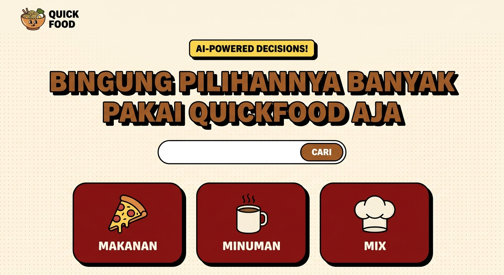
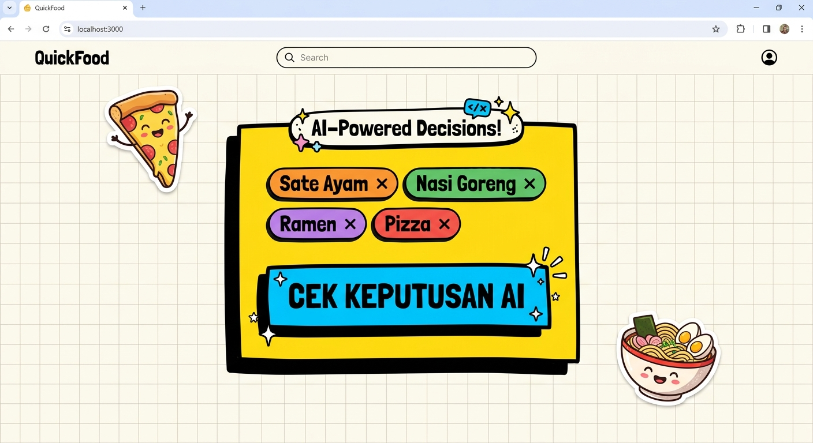

# 🍔 QuickFood: Keputusan Makanan Seru via AI & Google Maps

### 📸 Gambaran Aplikasi Real


### 🤖 Keputusan Makan Berbasis AI


**QuickFood** adalah aplikasi asisten kuliner interaktif yang dirancang dengan estetika visual **2D Cartoon Pop (Neo-Brutalist)** yang dinamis dan menyenangkan. Aplikasi ini membantu pengguna yang sering bingung memilih makanan dengan memanfaatkan kecerdasan buatan (AI) serta integrasi Google Maps Platform untuk pencarian restoran terdekat secara langsung.

---

## ✨ Fitur Utama

- **🧠 Google GenAI Decision Engine**: Menggunakan algoritme cerdas berbasis kecerdasan buatan untuk mengeliminasi kebingungan Anda dan memilih opsi makanan terbaik berdasarkan preferensi, cuaca lokal (real-time/simulasi), anggaran, dan kategori makanan.
- **📍 Integrasi Google Maps Terdekat**: Cari restoran atau gerai makanan terdekat secara otomatis berdasarkan lokasi perangkat Anda, lengkap dengan rute interaktif dan filter pencarian.
- **🏷️ Pengelolaan Pilihan Dinamis**: 
  - Batasan pintar 5 pilihan utama di antarmuka utama agar mata tetap nyaman dan bebas dari kepenatan visual.
  - Fitur **"Lihat Semua"** dengan modal pop-up interaktif untuk melihat daftar lengkap makanan jika daftar pilihan Anda terlalu panjang.
- **⚙️ Filter Optimasi Kontekstual**:
  - **Healthy Switch**: Mengubah rekomendasi menjadi opsi sehat alternatif.
  - **Insta-Fast**: Mengukur kesiapan penyajian secara kilat.
  - **Insta-Ready**: Tips and trik visual penyajian yang cocok untuk difoto atau diunggah ke media sosial.
- **🎨 Desain 2D Pop / Neo-Brutalist**: Estetika komik ceria dengan bayangan yang kontras (carbon stroke), warna cerah terkurasi, dan tata letak responsif yang nyaman digunakan baik di mobile maupun desktop.

---

## 🚀 Teknologi yang Digunakan

- **React 18 + TypeScript + Vite** — Fondasi aplikasi SPA yang cepat dan andal.
- **Tailwind CSS** — Penata gaya neo-brutalist dengan skema warna artistik.
- **Motion (Framer Motion)** — Animasi transisi antar layar dan animasi chip opsi yang halus.
- **Google Maps Platform (React-Google-Maps / Places API)** — Untuk lokasi yang akurat, pemetaan dinamis, dan pencarian otomatis tempat makan sekitar.
- **Lucide React** — Set ikon modern yang bersih dan intuitif.

---

## 🛠️ Cara Memulai

1. **Instalasi Dependensi**:
   ```bash
   npm install
   ```

2. **Jalankan Aplikasi Mode Pengembangan**:
   ```bash
   npm run dev
   ```

3. **Kompilasi Siap Produksi**:
   ```bash
   npm run build
   ```

---

*Dibuat dengan cinta untuk mengatasi kebingungan kuliner Anda sehari-hari! Selamat Mencoba!* 🍕🍜🍣
